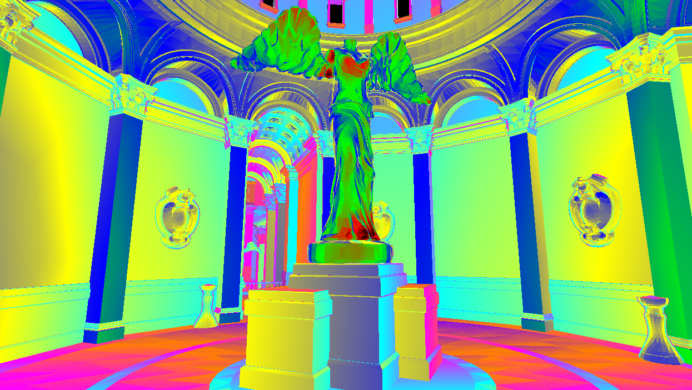
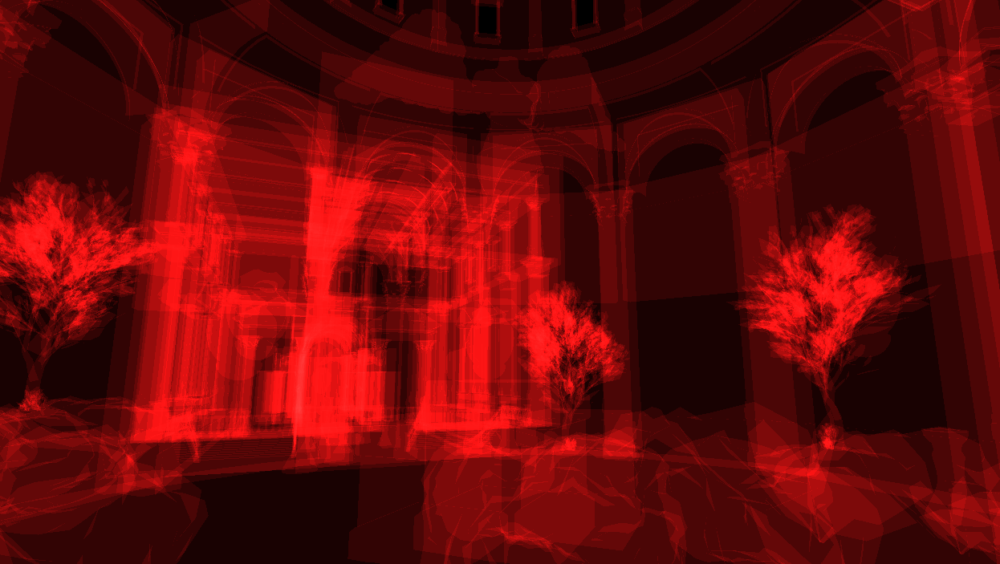
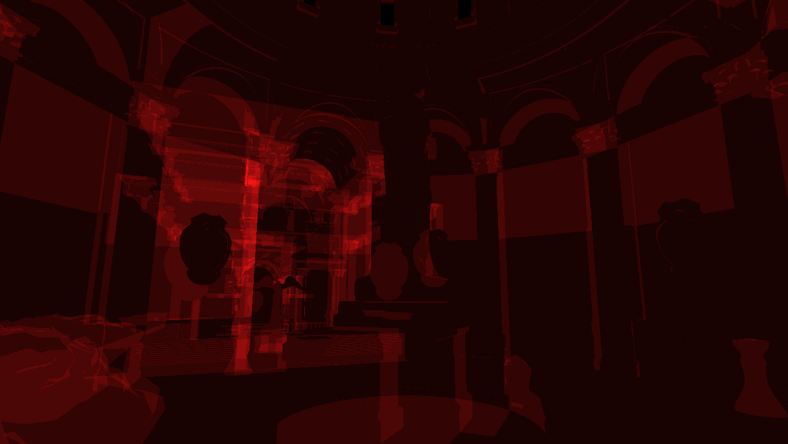
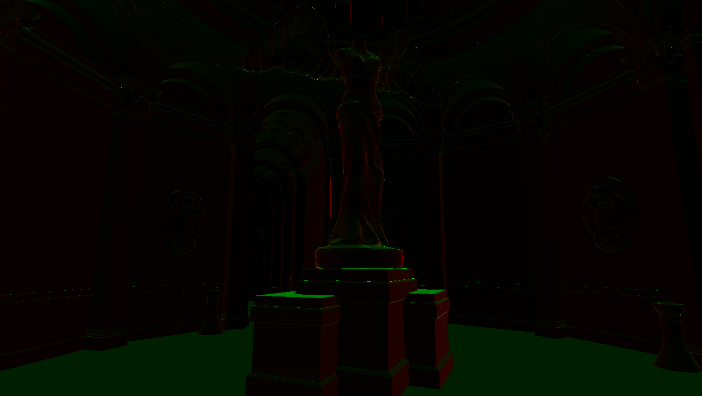

## Vulkan Renderer
A simple Vulkan renderer with Forward and Deferred shading.
Deferred is the default and most developed. Use Keys: 9 and 0 to switch between Forward and Deferred.

This renderer is for me to experiment with various graphics techniques.

## Rendering features: 
* Physically Based Shading (GGX)
* Screen-Space Reflections (SSR)
* Screen-Space Ambient Occlusion (HBAO)
* Bloom (Gaussian Blur)

## Debug visuals (Requires enabling Forward renderer)
* Mip-map visual
* Partial Derivative visual 
* Linear depth
* Mesh density

<table>
    <tr>
        <td></td>
	<td></td>
	<td></td>
	<td></td>
	<td></td>
    </tr>
</table>

## TODO:
* Indirect lighting solution 
* Bloom : (Next Generation Post Processing in Call of Duty)
